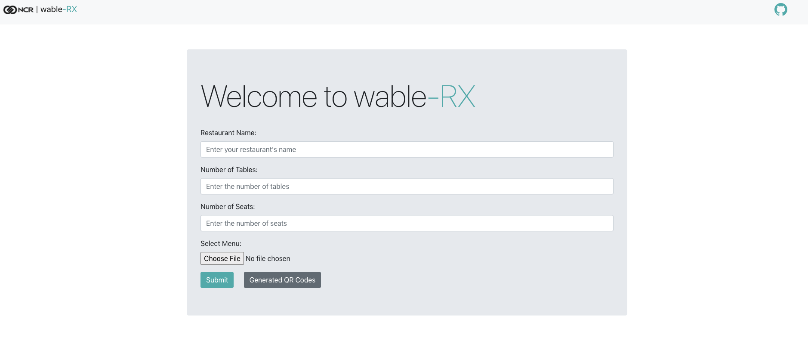
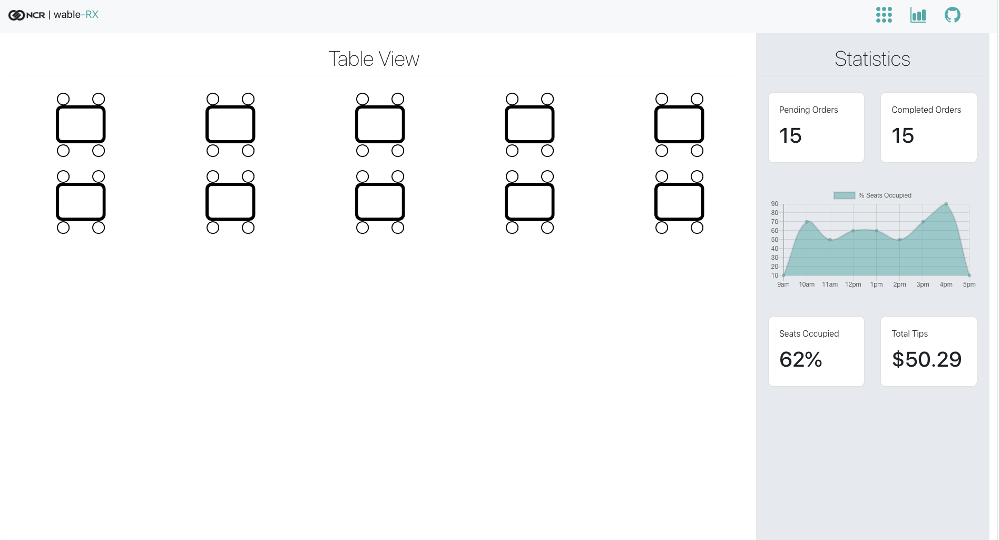
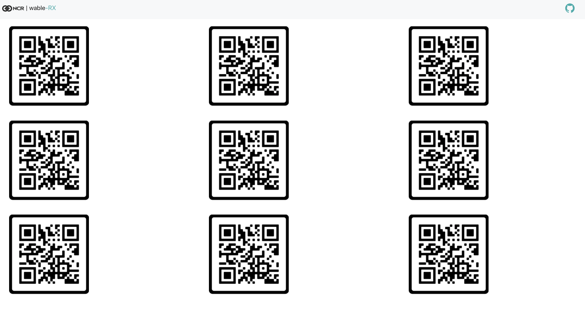
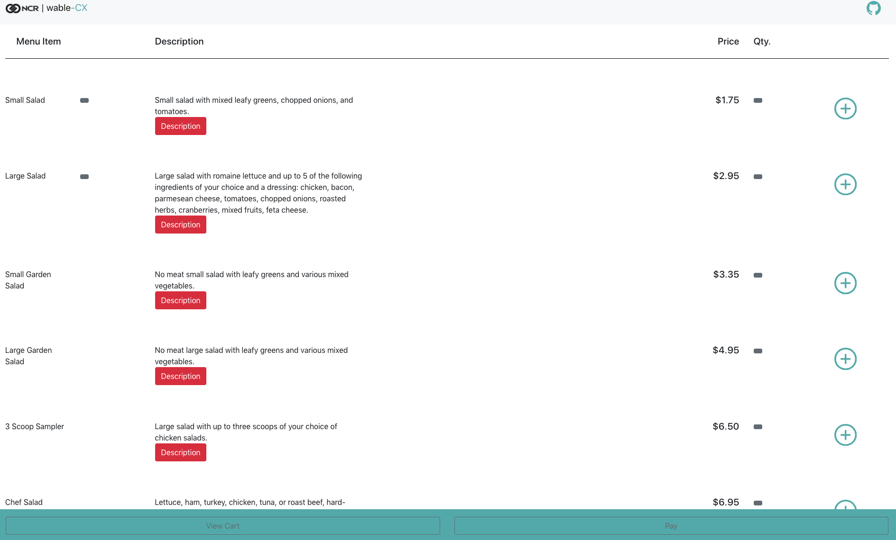

# wable
wable is a web platform for restaurants to utilize QR codes at tables as a way to create a seamless, contactless experience for customers to order, reduce physical waste through online receipts, as well as provide data analytics as insights for restaurant owners.
- Created during HackGT 2020, with NCR APIs.

wable utilizes two web apps, one for customers when they go to a restaurant, and one for restaurant employees and owners. The restaurant-side app has an overview of tables and seats for the restaurant, and the kitchen employees will log in to the restaurant side of the application depicted above which recieves the data of the order from each seat's unique QR code to keep track of each seat at each table. Waiters and servers will use this to be able to serve food more easily and keep track of where orders should go (shown below).

 Customers will be able to walk into a restaurant and scan a unique QR code at their table seat, taking them to an online menu where they can order food from the web app. They will be able to pay through Apple and Google Pay, as well as by inputting their credit card information. 
 

At the end of the meal customers will be billed a online receipt through their email they were prompted to input when they placed the order. If they request, they may get a physical receipt. This reduces waste and the cost of printing physical reciepts for the restaurant. The data received by each order will be stored and formatted into analytical insights for the restaurant owner, with information on various things such as popular orders, popular times of day, profit gained from specific orders and cost analysis of producing/buying ingredients for specific orders, and more.
